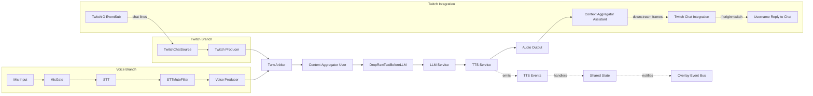

# Pipeline Architecture (Mermaid)

The pipeline merges concurrent Voice and Twitch branches into a single serialized turn stream, then runs LLM → TTS → Output. Turn arbitration ensures one active turn at a time with voice priority and fairness to chat.

Notes
- TurnArbiter flips any incoming `run_llm=True` appends to `False`, queues them, and re-emits exactly one at a time with `run_llm=True`.
- The “busy” period is from release until TTS stops (handlers flip `state.tts_speaking` which the arbiter listens to).
- Chat echo triggers at the end of assistant responses only when the active turn’s origin is `twitch`.

