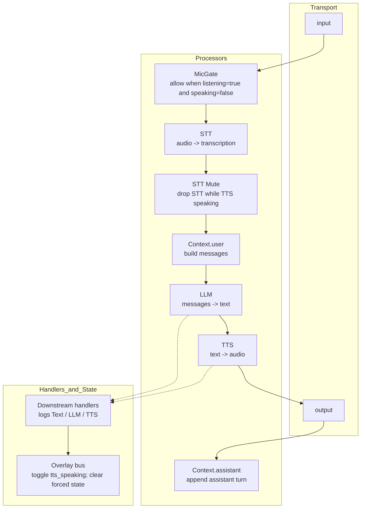
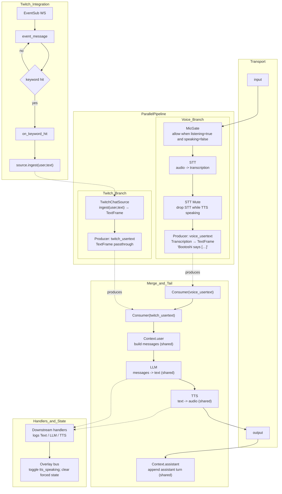
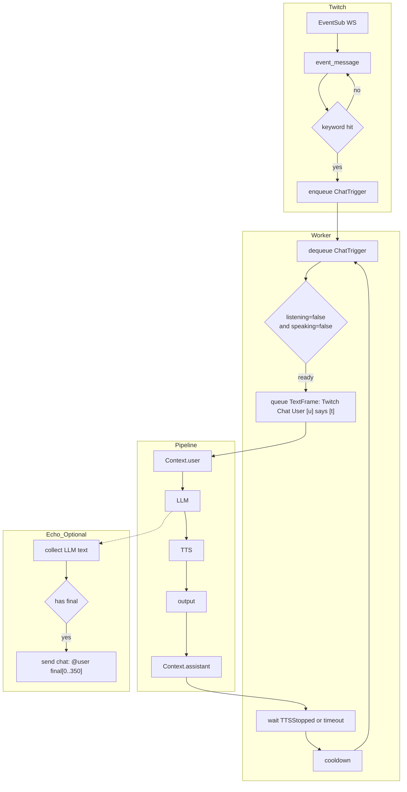

### Pipecat main pipeline

The pipeline is now assembled in `backend/src/pipeline/builder_parallel.py` (parallel branches) and run by `backend/src/pipeline/runner.py`. It wires audio I/O, gating, STT → LLM → TTS, and context aggregation. Downstream frame handlers in `backend/src/pipeline/handlers.py` log activity and synchronize the overlay (TTS started/stopped), updating shared state.

- The `MicGate` enforces speaking/listening rules at the audio level, preventing hot-mic while the agent is speaking.
- The STT mute filter ensures no transcriptions are processed while TTS is active, avoiding echo/feedback loops.
- Context aggregation maintains a chat-style history for both user and assistant turns.

### Parallel pipeline (voice + Twitch)

We split sources into two branches that run in parallel and merge just before `context_aggregator.user()`. Both sources append to the same conversation history and share LLM, TTS, output, and `context_aggregator.assistant()`.

- Voice path remains gated by `MicGate` and muted via `STTMuteFilter` during TTS.
- `TwitchChatSource` ingests chat programmatically and emits canonical `TextFrame`s (no dependency on mic state).
- Producers capture just the frames intended for the tail; Consumers inject them right before `Context.user()`.
- Both sources share a single LLM/TTS/output and append to the same context history.

### (Legacy) Twitch chat → pipeline integration

Prior design (kept here for context) used an internal queue/worker that waited on mic listening/speaking state and injected `TextFrame`s directly into the task. It has been replaced by the parallel design above.

- Keyword detection is configurable via `TWITCH_TRIGGER_WORDS` (default: `questboo,duck,chicken`).
- Echo-to-chat is controlled by `TWITCH_ECHO_ASSISTANT_TO_CHAT` (enabled by default).
- Broadcaster ID and user token are resolved to enable sending chat messages.
