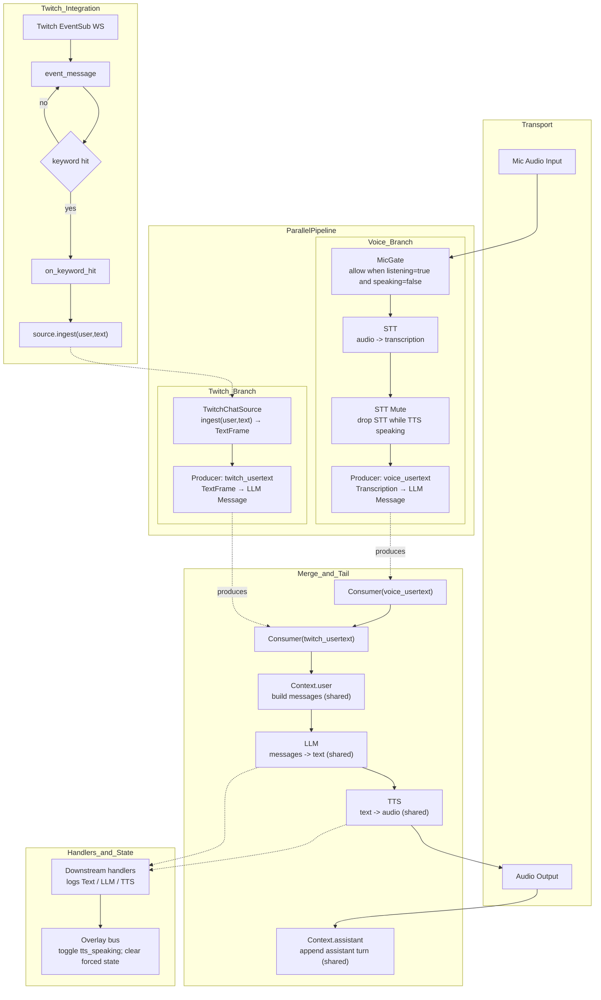

### Duck Buddy AI Pipeline

The pipeline is assembled in `backend/src/pipeline/builder.py` and run by `backend/src/pipeline/runner.py`. It features a parallel architecture to process voice input from the microphone and text input from Twitch chat simultaneously. Both branches merge into a common tail, allowing the AI to use a shared context, LLM, and TTS service.

Downstream frame handlers in `backend/src/pipeline/handlers.py` log activity and synchronize the overlay's animations by updating the shared state.

- **Voice Branch**: The voice path is gated by `MicGate` to enforce push-to-talk and is muted by `STTMuteFilter` during TTS to prevent feedback loops.
- **Twitch Branch**: The `TwitchChatSource` ingests chat messages programmatically from the Twitch integration and emits them into the pipeline, independent of the microphone's state.
- **Merge & Tail**: Producers in each branch create a normalized frame, which is then picked up by consumers. These consumers feed into the shared `Context.user` processor, ensuring both voice and chat contribute to the same conversational history for the LLM.
- **Twitch Integration**: A TwitchIO client listens for chat messages via EventSub. When a trigger keyword is detected, the message is sent to the `TwitchChatSource` to be injected into the AI pipeline.